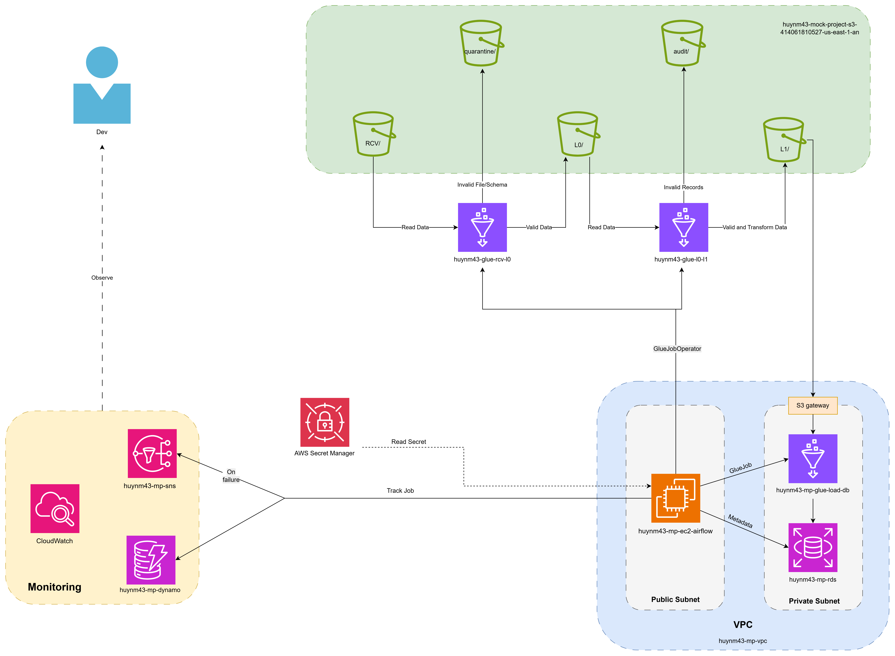
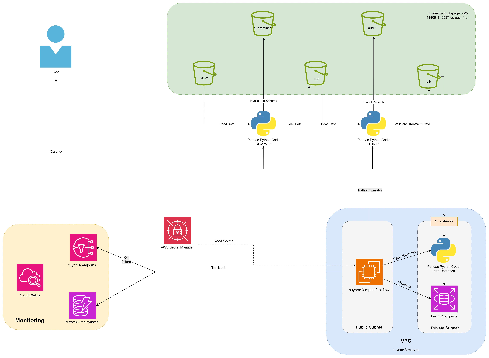

# AWS Data Pipeline

A batch data pipeline using Python, Apache Airflow, AWS services, and PostgreSQL.

## Documentation

### Project

- [Requirements](docs/01_project/requirements.md)
- [Project Analysis](docs/01_project/analyze.md)

### Specifications

- [Function Specifications - English](docs/02_specs/functions_specs_en.md)
- [Function Specifications - Vietnamese](docs/02_specs/functions_specs_vn.md)

### Architecture

- [AWS Glue Architecture](docs/03_architecture/architecture_glue.md)
- [Pandas Architecture](docs/03_architecture/architecture_pandas.md)
- [Data Flow](docs/03_architecture/dataflow.md)
- [Table Configuration](docs/03_architecture/table_config.md)

> Glue Architecture

> Glue Data Flow

> Pandas Architecture

> Pandas Data Flow

