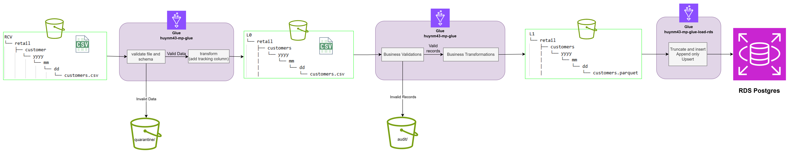
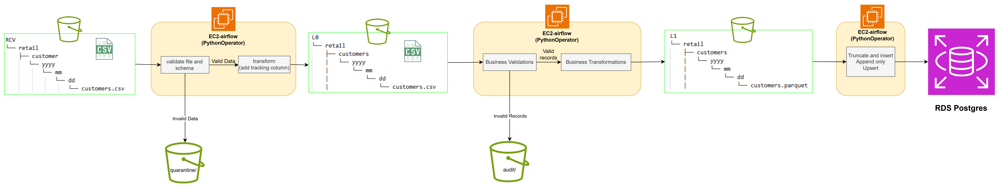

# Data Flow
## Overview
- Data Flow Glue:


- Data Flow Pandas:


> **Note:** The data flows for Glue and Pandas are the same; the differences are the components and frameworks used to process the data.

```text
RCV → validate_rcv_to_l0 (validate file, schema) → transform (add_columns) → L0
L0  → validate_l0_to_l1 (business validations)  → transform (business transformations) → L1
L1  → load_function (append_only / truncate_and_insert / upsert) → RDS PostgreSQL
```


## Stage 1 — RCV → L0 (File-level Validation, `rcv_to_l0`)

1. Load source (`rcv`) and target (`l0`) table configurations.
2. Build storage paths:
   - path_rcv = s3://{bucket}/{rcv_layer}/{schema}/{table}/{process_date}/{table}.{rcv_format}
   - path_l0 = s3://{bucket}/{l0_layer}/{schema}/{table}/{process_date}/{table}.{l0_format}
   - key_quarantine = {quarantine_layer}/{schema}/{table}/{process_date}/{table}.{rcv_format}

3. Execute `validations.validate_rcv_to_l0(context)`:
    - **`validate_file`**
      - Verify file existence.
      - Verify file readability.
      - Verify file is not empty.
      - Verify file contains data rows and not only a header.
      - On failure:
        - Copy original file to `quarantine/`
        - Raise exception
      - On success:
        - Read data directly into Spark DataFrame.
    - **`validate_schema`**
      - Compare actual columns against columns defined in table config.
      - Validate column names and column order.
      - On mismatch:
        - Copy file to `quarantine/`
        - Raise `Schema mismatch`

   - Validation rules are enabled/disabled via configuration:

```json
{
  "validation": {
    "validate_file": true,
    "validate_schema": true
  }
}
```

4. Execute `transformations.transform(context)`:
  - Apply `add_column` rules from RCV configuration.
  - Add:
    - `process_date` = `current_timestamp()`
    - `source_file` = file path
  - Perform final schema alignment using L0 target configuration:
    - Select target columns
    - Cast target datatypes
    - Missing columns are filled with `NULL`

5. Write output to L0.


## Stage 2 — L0 → L1 (Record-level Validation, `l0_to_l1`)
1. Load source (`l0`) and target (`l1`) configurations.
2. Read L0 data.
3. Execute `validate_l0_to_l1`: apply business validation (not_null, range, unique, duplicate, ...) in table config.
4. Execute business transformations defined in the table configuration (`split_name`, `split_address`, `rename_columns`, `filter_columns`, ...).
5. Align output schema with L1 target configuration.
6. Write transformed valid records to L1.
7. If invalid records exist: write error records to `audit/`


### Error Collection
- All validation failures are aggregated.
- Note: Each column may have many validation rules, and each record receives full validation against all rules.

Example:
```text
[
  "not_null(customer_id)",
  "range(kpi)",
  "duplicate(customer_id)"
]
```

### Audit Enrichment

Before writing invalid records to `audit/`, additional metadata columns are created.

| Column | Description |
|--|--|
| error_type | validation |
| error_message | Full validation messages |
| error_rule | Validation rule names |
| error_column | Columns involved |

Example:

| error_rule | error_column |
|--|--|
| not_null; range | customer_id; kpi |


## Stage 3 — L1 → RDS PostgreSQL (`l1_to_database`)

### Processing Flow
1. Retrieve the RDS password from the `GetObject` file. Glue retrieves it from the file, while Pandas gets secrets through PythonOperator.
2. Build database connection configuration:

```python
{
    "host": ...,
    "port": ...,
    "database": ...,
    "user": ...,
    "password": ...
}
```

3. Load L1 configuration.
4. Read L1 data.
5. Determine loading strategy:

```python
config["load_database"]["load_strategy"]
```

Supported strategies:

- `append_only`
- `truncate_and_insert`
- `upsert`

6. Create target table if it does not exist:

```sql
CREATE TABLE IF NOT EXISTS ...
```

- The DDL is generated dynamically from table config:

```yaml
columns:
```

7. Execute the selected load strategy.
```
customer      → upsert
product       → upsert
province      → truncate_and_insert
orders        → append_only
```